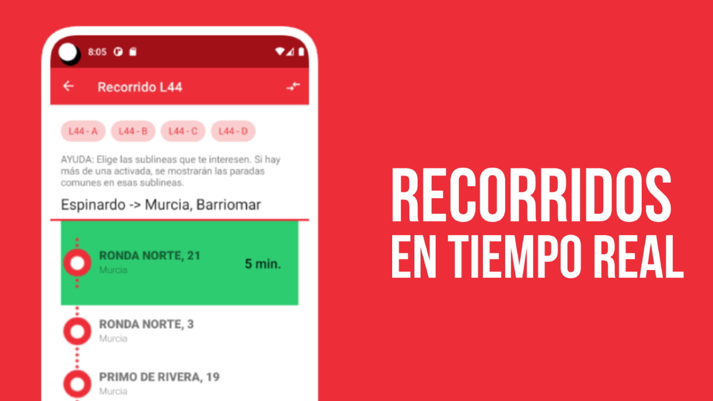

# 📲🚍 BUS Murcia APP - Horarios en tiempo real 

## Contexto

El 3 de diciembre de 2021 comenzó un nuevo servicio de transporte público para la ciudad de Murcia y sus pedanías.

El nuevo servicio está siendo operado por la empresa Monbus. Hasta entonces, la empresa que realizaba ese servicio (Latbus) tenía una aplicación que informaba a los usuarios de las llegadas del bus en tiempo real, aunque no era muy práctica y sus predicciones eran bastante imprecisas.

Esa app la ha mantenido la actual empresa concesionaria, sin realizar ninguna modificación.

Entonces, comencé el desarrollo de una nueva app que fuera mucho más práctica para el usuario.

## Descargar aplicación

## Capturas de pantalla

## 쮺칩mo lo he hecho?
Se trata de una aplicación nativa desarrollada en Kotlin, utilizando OpenStreetMap (osmdroid) para los mapas.

La APP consume la API de TMP Murcia para mostrar la información de los horarios, recorridos, llegadas en tiempo real...

El formato de los datos sigue la especificación [SIRI](https://en.wikipedia.org/wiki/Service_Interface_for_Real_Time_Information).

La APP no precisa de un webservice externo ni de terceros. Para almacenar la información de los sitios favoritos se utiliza una base de datos local. [Android Room](https://developer.android.com/training/data-storage/room)

Además, se cachea la información correspondiente a horarios y rutas por parada para agilizar el acceso (los horarios y rutas pueden cambiar de un día a otro).

En cuanto a la información en tiempo real, se utiliza una forma diferente de calcular las próximas llegadas del bus. Lo que se hace es sumar el retraso acumulado del autobús a la hora teórica de llegada, produciendo unas predicciones mucho más exactas.

El valor del retraso acumulado del autobús lo gestiona directamente la API de TMP y se actualiza en cada parada.

## Features

- [x] Llegadas del bus en tiempo real
- [x] Acceso rápido a ubicaciónes guardadas.
- [x] Recorridos en tiempo real.

## Build environment

1. Min Android SDK version: Android 4.4 (nivel de API 19)
2. Android Studio Chipmunk | 2021.2.1 
3. Gradle version 6.5
4. Build tools version 30.0.3

## Build Instructions

1.Download the source code;

> $ git clone https://github.com/youngsdeveloper/busmurcia-app.git

2.Next, Make a copy of gradle.properties.example as gradle.properties and edit the information inside;

> $ cp gradle.properties.example gradle.properties

3.Finally, Will the project import Android Studio, click to run, I wish you good luck!

## Créditos
- [Web oficial de TMP Murcia (operadora del servicio)](http://tmpmurcia.es/)

## License
MIT License

Copyright (c) [2022] [Enrique Rodríguez Lopez]

Permission is hereby granted, free of charge, to any person obtaining a copy of this software and associated documentation files (the "Software"), to deal in the Software without restriction, including without limitation the rights to use, copy, modify, merge, publish, distribute, sublicense, and/or sell copies of the Software, and to permit persons to whom the Software is furnished to do so, subject to the following conditions:

The above copyright notice and this permission notice shall be included in all copies or substantial portions of the Software.

THE SOFTWARE IS PROVIDED "AS IS", WITHOUT WARRANTY OF ANY KIND, EXPRESS OR IMPLIED, INCLUDING BUT NOT LIMITED TO THE WARRANTIES OF MERCHANTABILITY, FITNESS FOR A PARTICULAR PURPOSE AND NONINFRINGEMENT. IN NO EVENT SHALL THE AUTHORS OR COPYRIGHT HOLDERS BE LIABLE FOR ANY CLAIM, DAMAGES OR OTHER LIABILITY, WHETHER IN AN ACTION OF CONTRACT, TORT OR OTHERWISE, ARISING FROM, OUT OF OR IN CONNECTION WITH THE SOFTWARE OR THE USE OR OTHER DEALINGS IN THE SOFTWARE.

